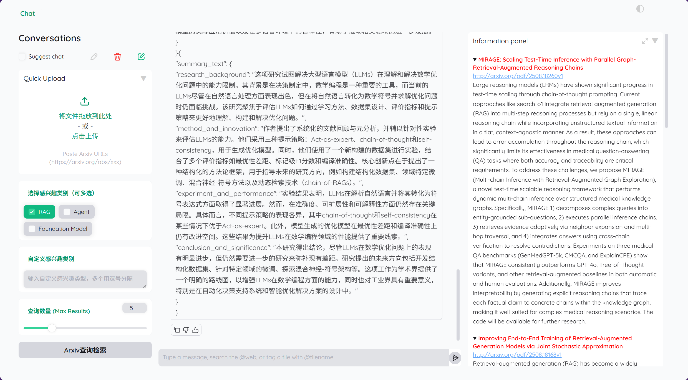

# HelloPaper: Help you to fully inderstand your paper

## 技术栈与核心技术

* RAG（Retrieval-Augmented Generation）：基于向量数据库的文档检索与问答，目前实现了基础RAG（检索+生成）。
* Agent：支持自动化论文检索与结果保存，具备初步工具调用能力。
* 界面与交互：基于 Gradio 构建可视化交互界面。

## 主要功能

* 本地PDF智能问答：用户上传PDF，通过RAG实现问答，并提供相关片段引用。
* Arxiv论文问答：用户提供Arxiv链接，自动下载PDF并进行基于内容的问答。
* 关键词论文检索与总结：用户输入关键词，系统从Arxiv检索相关论文并生成结构化总结。

## 界面展示

